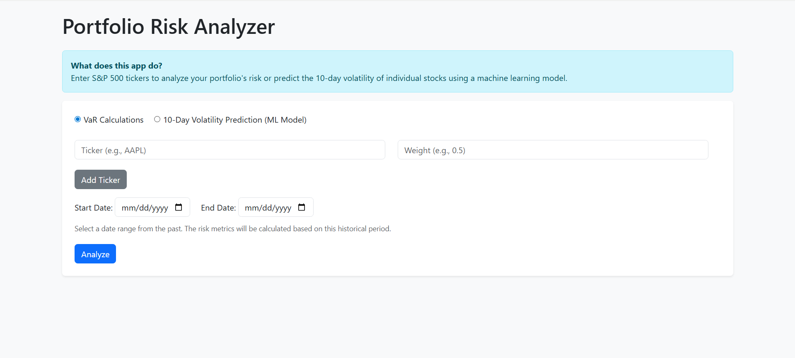
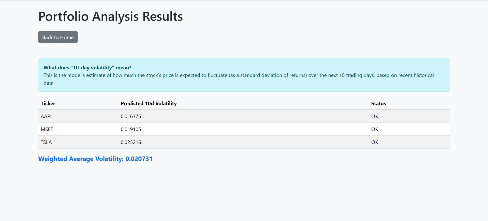

# 📊 Portfolio Risk Analyzer

A web-based tool for analyzing portfolio risk, visualizing historical performance, and predicting short-term volatility using machine learning.  
👉 Live Demo: [Portfolio Risk Analyzer on Render](https://portfolio-risk-analyzer-f7of.onrender.com)

---

## 🚀 Features

- **Portfolio Risk Analysis:**  
  Enter S&P 500 tickers and weights to analyze historical volatility, Value at Risk (VaR), Sharpe/Sortino ratios, drawdown, and more.
- **ML Volatility Prediction:**  
  Predict the next 10-day volatility for one or more stocks using a trained XGBoost model.
- **Interactive Web UI:**  
  Clean, Bootstrap-styled interface with tooltips, error handling, and visualizations.
- **Visualizations:**  
  Cumulative returns, return distributions, and Monte Carlo simulation plots.
- **Robust Input Validation:**  
  Friendly error messages and guidance throughout.

---

## 🏗️ Project Structure

portfolio-risk-analyzer/
│
├── app/
│ ├── init.py # Package init (exposes app)
│ ├── app.py # Flask app entry point
│ ├── ml/ # ML pipeline and model files
│ ├── plotting.py # Graph creation functions
│ ├── risk_metrics.py # Core portfolio analysis
│ ├── static/ # Generated graphs
│ └── templates/ # HTML templates
│
├── requirements.txt
├── Procfile
├── README.md
└── ...


---

## 🖥️ Tech Stack

- **Backend:** Python, Flask  
- **Machine Learning:** XGBoost, scikit-learn, pandas, numpy  
- **Visualization:** Matplotlib, Seaborn  
- **Frontend:** HTML, Bootstrap, Jinja2 templates  
- **Deployment:** Render  

---

## ⚙️ Setup & Usage

1. **Clone the repository**
    ```sh
    git clone https://github.com/yourusername/portfolio-risk-analyzer.git
    cd portfolio-risk-analyzer
    ```

2. **Create and activate a virtual environment**
    ```sh
    python -m venv venv
    # On Windows:
    venv\Scripts\activate
    # On macOS/Linux:
    source venv/bin/activate
    ```

3. **Install dependencies**
    ```sh
    pip install -r requirements.txt
    ```

4. **Run locally**
    ```sh
    python app/app.py
    ```
    Then open your browser at [http://127.0.0.1:5000](http://127.0.0.1:5000)

---

## ☁️ Deployment (Render)

This app is live on [Render](https://render.com).  
To deploy your own copy:

1. Make sure you have a `Procfile` with:

web: gunicorn app.app:app

(`__init__.py` inside `app/` makes `app` directly importable.)

2. Push your code to GitHub.

3. On Render, create a **new Web Service**:
- **Build command:**  
  ```
  pip install -r requirements.txt
  ```
- **Start command:**  
  ```
  gunicorn app:app
  ```

4. Deploy — Render will handle the rest.

---

## 🖼 Example Screenshots

| Home Page | Results Page |
|-----------|--------------|
|  |  |

---

## 📜 License

MIT License

---

## 💡 Future Improvements

- Enhanced frontend styling
- More risk metrics (e.g., expected shortfall)
- Save/load portfolio configs
- User authentication (optional)
