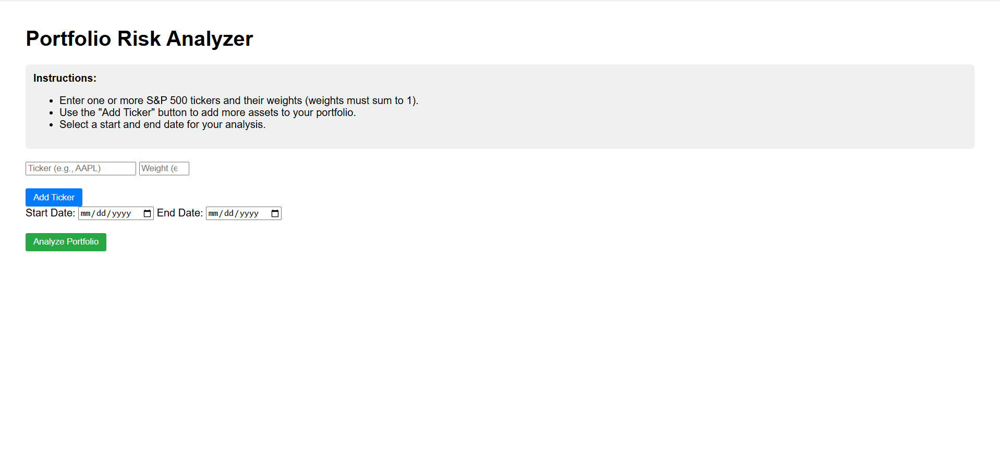
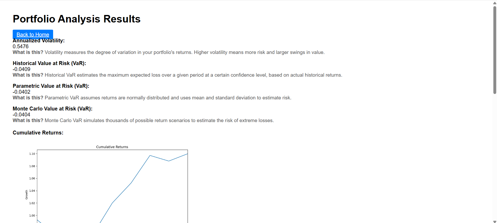
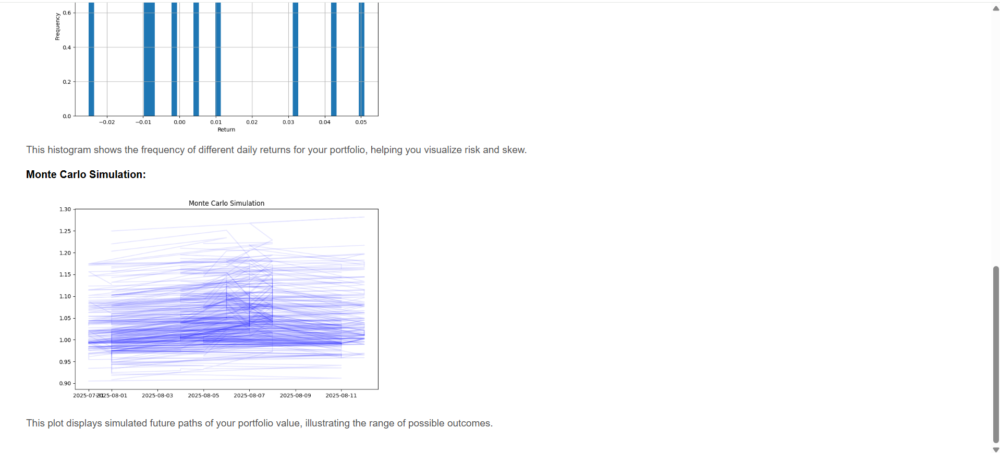

# 📊 Portfolio Risk Analyzer

[](https://www.python.org/)
[](https://flask.palletsprojects.com/)
[](LICENSE)

A web-based tool for analyzing portfolio risk, visualizing historical performance, and running simulations such as Monte Carlo forecasting.  
Built with **Flask**, **Pandas**, **Matplotlib**, and **yfinance**.

---

## 🚀 Features

- Enter a list of S&P 500 tickers and their weights for analysis
- Fetch historical price data via `yfinance`
- Calculate:
  - Daily returns
  - Cumulative returns
  - Portfolio volatility
  - Value at Risk (historical, parametric, Monte Carlo)
- Generate visualizations:
  - Cumulative returns over time
  - Return distribution histogram
  - Monte Carlo simulation outcomes
- Web-based frontend for easy interaction and visualization
- Robust input validation and error handling

---

## 📂 Project Structure

```
portfolio-risk-analyzer/
│
├── app/                  # Flask app & backend logic
│   ├── static/           # Generated graphs
│   ├── templates/        # HTML templates
│   ├── plotting.py       # Graph creation functions
│   ├── risk_metrics.py   # Core portfolio analysis
│   └── app.py            # Flask app entry point
│
├── tests/                # Unit tests
├── requirements.txt      # Python dependencies
├── README.md             # Project documentation
├── LICENSE               # MIT license
└── screenshots/          # Example screenshots 
```

---

## ⚙️ Installation & Usage

1. **Clone the repository**
    ```sh
    git clone https://github.com/khfong26/portfolio-risk-analyzer.git
    cd portfolio-risk-analyzer
    ```

2. **Create and activate a virtual environment** (recommended)
    ```sh
    python -m venv venv
    # On Windows:
    venv\Scripts\activate
    # On macOS/Linux:
    source venv/bin/activate
    ```

3. **Install dependencies**
    ```sh
    pip install -r requirements.txt
    ```

4. **Run the app**
    ```sh
    python app/app.py
    ```
    Then open your browser and go to:  
    [http://127.0.0.1:5000](http://127.0.0.1:5000)

---

## 🖼 Example Output

| Home Page (`front_page.png`) | Results Page (Top) (`results_page_1.png`) | Results Page (Bottom) (`results_page_2.png`) |
|-----------------------------|-------------------------------------------|----------------------------------------------|
|  |  |  |
---

## 📜 License

This project is licensed under the MIT License - see the [LICENSE](LICENSE) file for details.

---

## 💡 Future Improvements

- Enhanced frontend styling
- More detailed risk metrics (e.g., max drawdown, Sharpe ratio)
- Ability to save & load portfolio configurations
- Support for different data sources beyond Yahoo Finance
